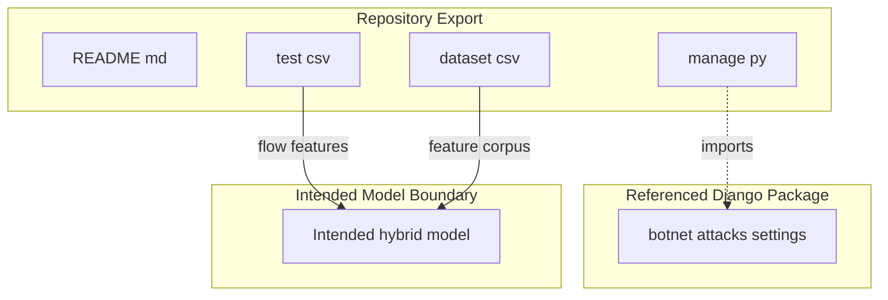
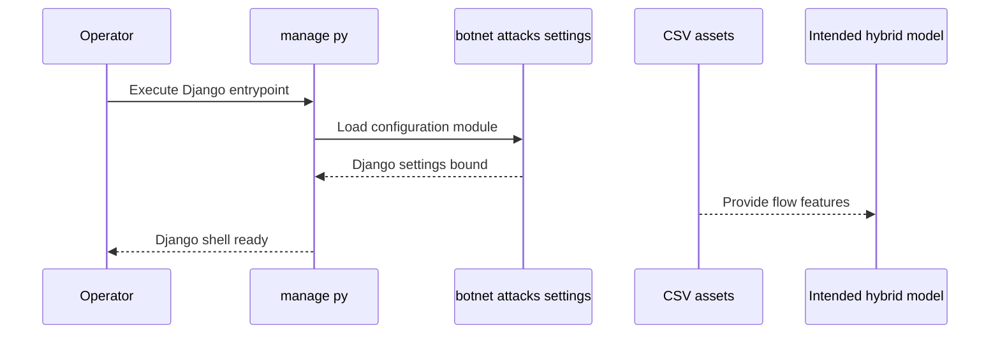

# Repository purpose, current implementation boundary, and evidenced architecture

# Botnet Detection Scope and Repository Architecture

## Overview

This repository exports a minimal botnet-detection project shell. The surfaced files show a project label in `README.md`, a single Django bootstrap entrypoint in `manage.py`, and tabular CSV assets that expose the network-flow and statistical feature space intended for model input.

The repository export proves a Django-oriented application boundary plus data assets. It does not prove a complete training or inference stack: no model code, notebooks, API views, app modules, service layers, or deployment artifacts are surfaced alongside the bootstrap file and CSV data.

## Repository Evidence and Scope

| File | What it proves | Architectural meaning |
| --- | --- | --- |
| `README.md` | The repository is named as a botnet-detection project. | The export carries project identity, but no implementation narrative. |
| `manage.py` | Django boots through `botnet_attacks.settings`. | The repository has a Django startup boundary. |
| `test.csv` | The repository includes network-flow feature data for model input. | The intended detection logic consumes tabular flow/statistical features. |
| `dataset.csv` | A dataset asset is listed and exported with the repository. | The repository includes data material beyond the test sample. |

## Architecture Overview

The exported repository content establishes a project shell and data corpus, not a finished botnet-detection service. The only executable application file surfaced is manage.py, and the only framework boundary named there is botnet_attacks.settings. [!NOTE] manage.py references botnet_attacks.settings, but the export does not surface the botnet_attacks package tree. The configuration boundary is named, not fully evidenced in the retrieved files.

The diagram shows the repository as a shell around two proven parts: a Django startup hook and data assets. The model boundary is only implied by the data files and the project framing; no model implementation is surfaced.

## Repository Shell Components

### `README.md`

*README.md*

`README.md` only names the project. It establishes the repository identity but does not describe the model, the data pipeline, or any serving interface.

| Evidence | Meaning |
| --- | --- |
| Project name only | The repository is framed as a botnet-detection project. |
| No surfaced architecture text | The export does not prove component layout from the README alone. |

### `manage.py`

*manage.py*

`manage.py` is the only executable application file surfaced by the export. Its role is to bootstrap Django using `botnet_attacks.settings`, which proves a Django project boundary and a configuration entrypoint.

| Evidence | Meaning |
| --- | --- |
| Boots `botnet_attacks.settings` | The repository is wired as a Django application shell. |
| Only surfaced executable code | No other application logic is proven in the export. |

### `test.csv`

*test.csv*

`test.csv` exposes the network-flow feature space that the intended hybrid model would consume. The file demonstrates that the repository is organized around tabular flow/statistical input rather than image, text, or unstructured payload data.

| Evidence | Meaning |
| --- | --- |
| Network-flow features | The model input domain is flow-based detection data. |
| Statistical/tabular shape | The intended model operates on structured numeric or categorical features. |

### `dataset.csv`

*dataset.csv*

`dataset.csv` is the manifest-listed dataset asset exported with the repository. It reinforces that the repository contains data inputs relevant to botnet detection, separate from executable code.

| Evidence | Meaning |
| --- | --- |
| Dataset asset | The repository includes additional data material beyond the test sample. |
| Manifest-listed file | The repository export intentionally includes data for downstream consumption. |

## Referenced Django Package Boundary

*`botnet_attacks.settings`*

`manage.py` names `botnet_attacks.settings` as the Django settings module. That gives the repository a configuration boundary, but the package contents that would define settings, apps, middleware, URLs, or installed components are not surfaced in the retrieved export.

| Boundary Element | Proven by export | Not proven by export |
| --- | --- | --- |
| `botnet_attacks.settings` | The settings module name is referenced directly by `manage.py`. | The concrete settings values, app registrations, URL patterns, and middleware stack. |

## Implementation Boundary

The export proves a narrow implementation boundary:

- a Django bootstrap entrypoint exists;
- data assets exist for a tabular botnet-detection workflow;
- the project is framed around a hybrid model consuming network-flow features.

The export does not surface any of the following implementation layers:

- model-training code;
- inference code;
- notebooks;
- API views;
- Django app modules;
- service layers;
- deployment assets.

This makes the repository evidence consistent with a project scaffold plus datasets, not with a complete end-to-end detection application.

## Data Asset Boundary

The data files imply a feature-centric detection pipeline:

- `test.csv` represents the evaluation or sample-input side of the feature space.
- `dataset.csv` represents the broader data corpus available to the project.
- Both point toward structured network-flow records suitable for a hybrid detection model.

## Architecture Implications

The repository export supports a very specific architectural reading:

- the application layer is only evidenced as a Django bootstrap;
- the data layer is evidenced as CSV assets;
- the model boundary is implied, not implemented in the surfaced files.

That means the repository currently documents intent and input data more clearly than executable detection logic. The strongest proof in the export is the pairing of `manage.py` with the feature-bearing CSV files.

## Key Classes Reference

| Class | Location | Responsibility |
| --- | --- | --- |
| `manage.py` | `manage.py` | Boots Django through `botnet_attacks.settings` as the only surfaced executable application path. |
| `README.md` | `README.md` | Names the project and establishes repository identity. |
| `test.csv` | `test.csv` | Provides the network-flow feature space for intended model input. |
| `dataset.csv` | `dataset.csv` | Supplies the manifest-listed dataset asset for the project. |

---
