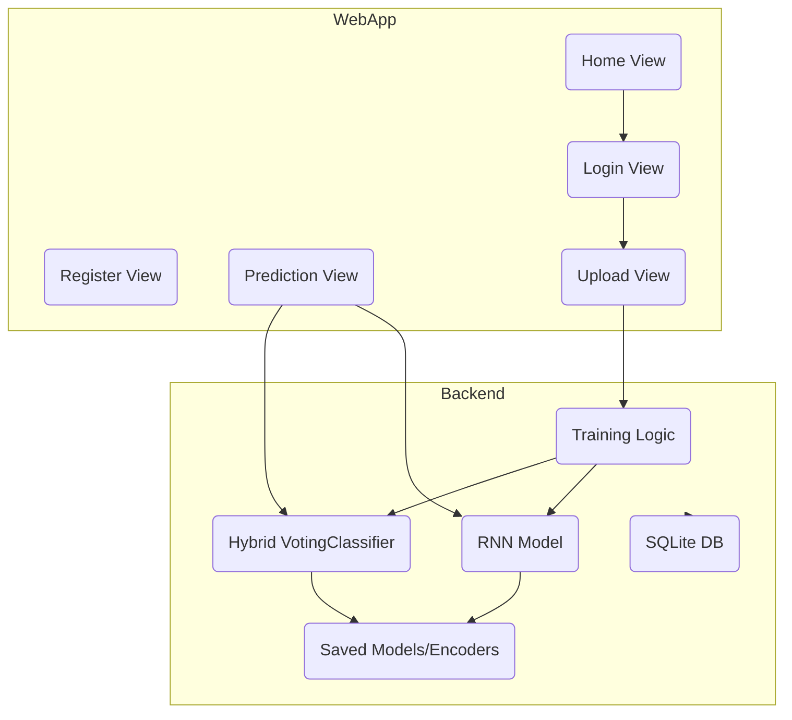

# Hybrid Botnet Detection in IoT Using Machine Learning

## Project Overview

This repository is a Django-based web application for botnet attack detection in IoT environments using a hybrid machine learning model. It enables user registration, data upload, model training (including a hybrid Voting Classifier and an RNN), and prediction on network flow datasets. The project integrates a user-friendly frontend, dataset management, and advanced analytic reporting to support detection and research on IoT-targeted botnets.

---

## Features

- **User Authentication:** Secure sign-up, login, and session management.
- **Dataset Management:** Upload and preprocess raw CSV network-flow datasets.
- **Automated Preprocessing:** Label encoding, train-validation splitting, feature engineering.
- **Hybrid ML Model:** VotingClassifier ensemble (Random Forest, SVM, Logistic Regression) with persistent training.
- **Deep Learning Model:** Optional RNN model for sequence-based classification.
- **Prediction Interface:** Web form for user input and attack-type prediction (DDoS, DoS, Reconnaissance, Normal).
- **Analytics & Visualization:** Plots for class distributions, confusion matrices, and classification reports.
- **Persistence:** All models and encoders saved/loaded with joblib for fast reuse.

---

## File/Directory Structure

| File/Dir   | Description                                                                                       |
|------------|---------------------------------------------------------------------------------------------------|
| `manage.py`             | Boots Django application using `botnet_attacks.settings`                              |
| `apps.py`               | Django app config (named `application`)                                               |
| `views.py`              | All core web logic: user management, file upload, model training, prediction, and metrics |
| `tests.py`              | Placeholder for Django tests                                                          |
| `dataset.csv`           | Example/train dataset: network-flow feature records                                   |
| `test.csv`              | Small test/evaluation CSV, identical column format to train                           |
| `db.sqlite3`            | Django database (auto-managed; can be reset)                                         |
| `ABSTRACT.docx`         | Project abstract                                                                      |
| `Hybrid.docx`, `Hybrid Machine Learning Model for Efficient Botnet Attack Detection in IoT Environment.pdf` | Research documentation/paper  |
| `__init__.py`           | Python package marker                                                                 |

---

## ML Pipeline & Features

Data files (`dataset.csv`, `test.csv`) contain structured tabular features. Core features used by the model include:

- `pkSeqID`, `proto`, `saddr`, `sport`, `daddr`, `dport`, `seq`, `stddev`, `drate`, `srate`, `min`, `max`, `mean`, `state_number`, `N_IN_Conn_P_SrcIP`, `N_IN_Conn_P_DstIP` and more.

Preprocessing steps are performed automatically upon file upload:
- Categorical columns are label-encoded.
- Dataset is split into train/test sets.
- Encoder artifacts are persisted to disk for use during prediction.

---

### Hybrid Model

Implemented in `views.py`, the hybrid model ensemble combines:
- Random Forest
- SVM (probabilistic, for VotingClassifier)
- Logistic Regression

They are soft-voted via scikit-learn's VotingClassifier, which increases overall detection robustness.

#### RNN Model

An optional RNN (using Keras) is provided for advanced sequence learning on flows. Users can trigger this model post-upload if desired.

#### Prediction

A dedicated prediction endpoint processes manual or API-based feature entry and returns a class (DDoS/DoS/Reconnaissance/Normal). Backend ensures label encoding aligns with trained model state.

---

## Web Interface

Frontend views (templates not included in this repo, assumed under Django templates):

- `/register` — user sign-up  
- `/login` — user login  
- `/upload` — upload/preview dataset  
- `/train` — model training, evaluation metrics  
- `/predict` — prediction on new flows  
- `/logout` — session end

---

## How to Run

1. **Install requirements:**
   ```bash
   pip install django scikit-learn pandas matplotlib seaborn catboost tensorflow joblib
   ```

2. **Run Django migrations and start server:**
   ```bash
   python manage.py migrate
   python manage.py runserver
   ```
3. **Navigate to** `http://127.0.0.1:8000/` and register a new user.

4. **Upload your CSV data** at the `/upload` endpoint and follow on-screen instructions to train and evaluate models.

---

## Architectural Diagram


```mermaid
flowchart TD
    subgraph WebApp
        Home(Home View)
        Register(Register View)
        Login(Login View)
        Predict(Prediction View)
        Upload(Upload View)
    end

    subgraph Backend
        TrainScript(Training Logic)
        HybridML(Hybrid VotingClassifier)
        RNNModel(RNN Model)
        DB(SQLite DB)
        Filesystem(Saved Models/Encoders)
    end

    Home --> Login
    Login --> Upload
    Upload --> TrainScript
    TrainScript --> HybridML
    TrainScript --> RNNModel
    HybridML --> Filesystem
    RNNModel --> Filesystem
    Predict --> HybridML
    Predict --> RNNModel
    Backend --> DB
```

---

## Datasets

- `dataset.csv` and `test.csv` provide example traffic flows, with one record per row and meaningful network edge/flow statistics.
- Users can upload new datasets using the web interface.

---

## Documentation and Research

- See `Hybrid Machine Learning Model for Efficient Botnet Attack Detection in IoT Environment.pdf` and `ABSTRACT.docx` for theoretical and implementation context.
- For architecture or methodology questions, refer to or cite the embedded research files.

---

## Contribution & Future Work

- Add support for API/REST endpoints (Django REST Framework).
- Include more advanced deep learning models (e.g., LSTM, Transformers).
- Integrate live attack simulation or real-time detection dashboard.
- Expand unit tests in `tests.py`.
- Template frontend is assumed — contribute HTML/JS frontend for better UX.

---

## License

Intended for academic and research purposes.

---

## Authors

Developed by [tomato9553-bit](https://github.com/tomato9553-bit)

